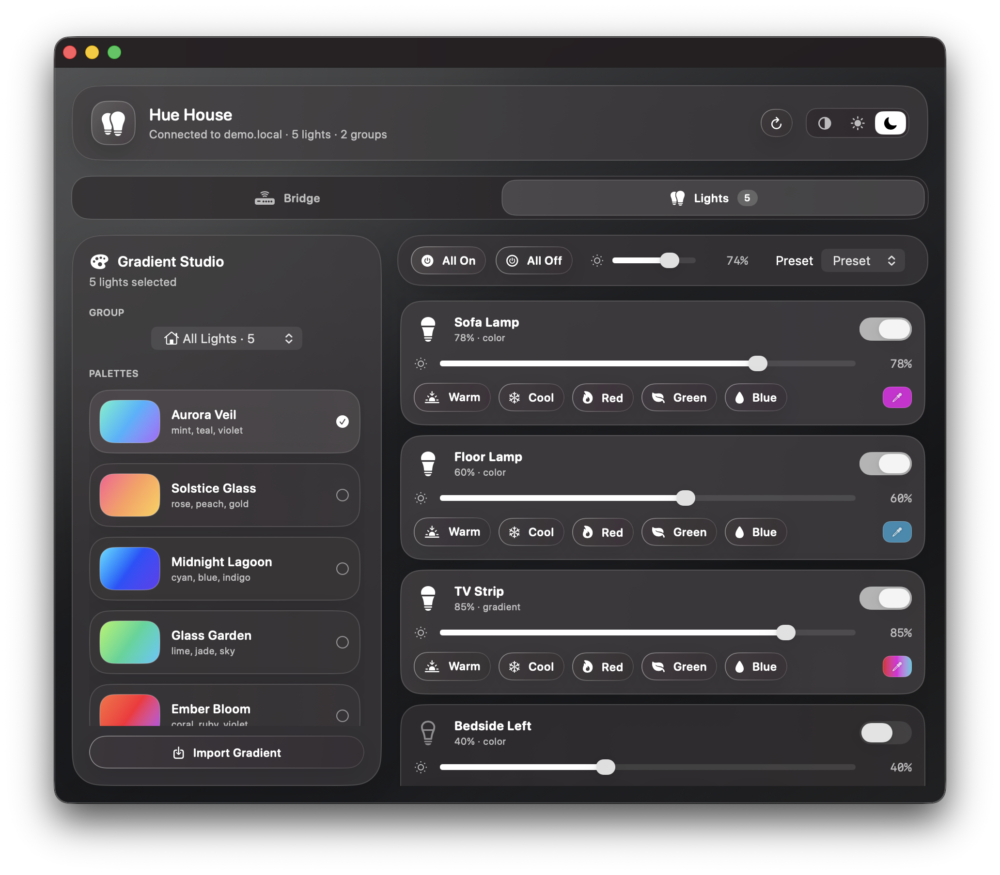
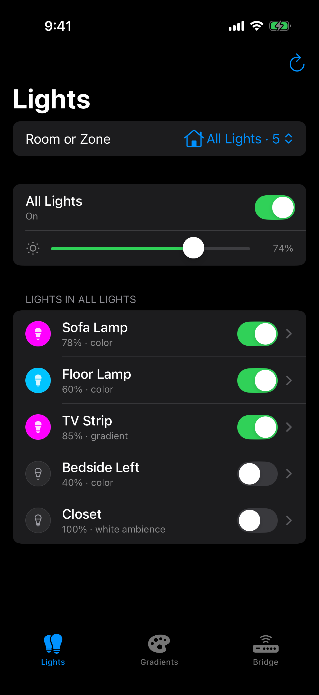
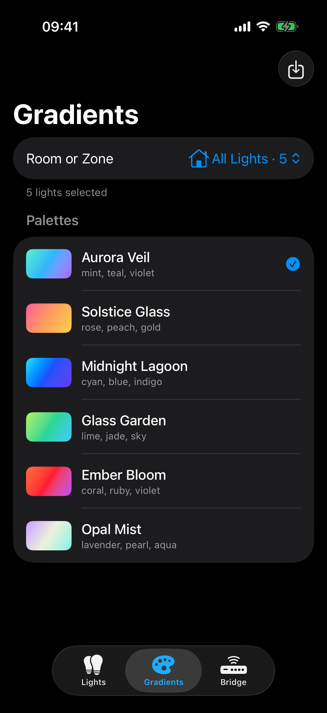
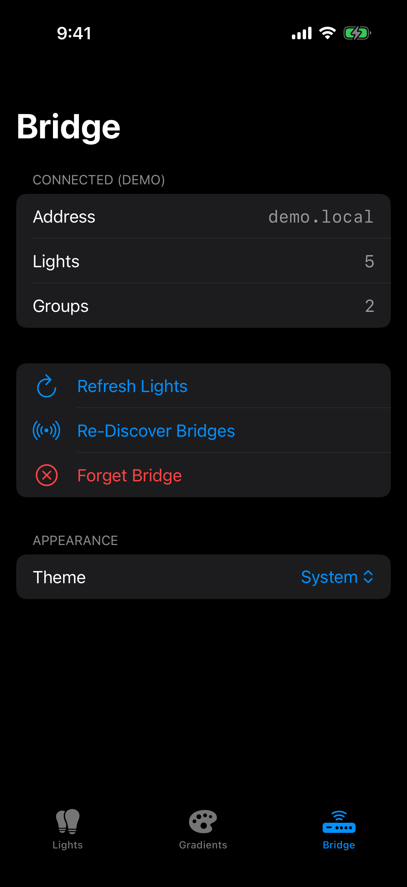

<h1 align="center">Hue House</h1>

<p align="center">
  Native macOS and iOS control surface for Philips Hue lights, gradients, Siri, and Shortcuts.
</p>

<p align="center">
  <a href="https://github.com/yennster/hue-house/releases">
    
  </a>
  <a href="https://www.swift.org">
    
  </a>
  
  
  <a href="https://github.com/yennster/hue-house/stargazers">
    
  </a>
  <a href="https://github.com/yennster/hue-house/blob/main/LICENSE">
    
  </a>
  
</p>

<p align="center">
  <a href="#highlights">Highlights</a>
  <span> - </span>
  <a href="#install">Install</a>
  <span> - </span>
  <a href="#pair-your-bridge">Pair your bridge</a>
  <span> - </span>
  <a href="#gradient-studio">Gradients</a>
  <span> - </span>
  <a href="#siri-and-shortcuts">Siri</a>
  <span> - </span>
  <a href="#packaging">Packaging</a>
  <span> - </span>
  <a href="#ios-app">iOS app</a>
</p>

<p align="center">
  
</p>

## Highlights

Hue House is a SwiftUI app for finding a Philips Hue Bridge on your local network, pairing with it once, and controlling the lights in your house from a polished Apple-style interface — on both macOS and iOS, sharing a single networking + state core.

| Area | What it does |
| --- | --- |
| Multi-platform core | A shared `HueKit` Swift package contains all the bridge networking, state, gradient parsing, and color math. Both the macOS app and the iOS app are thin SwiftUI shells over the same library. |
| Bridge setup | Automatic local-network scan with Hue cloud discovery as a fallback. Manual IP entry is tucked away as an escape hatch. |
| Light controls | Toggle each light, scrub brightness, and apply quick-color presets (Warm, Cool, Red, Green, Blue). All On / All Off act on the currently-selected room or zone. |
| Per-light RGBA picker | Each color-capable light has an in-app color popover (macOS) / sheet (iOS) with R, G, B, and A (alpha-as-brightness) sliders. The preview seeds from the bulb's actual current color via the Hue API. |
| Rooms and zones | Pick the whole house, a room, or a Hue zone before applying actions. The light list and toolbar buttons all scope to the selection. |
| Gradient Studio | Six built-in multi-color palettes plus a CSS gradient importer for unlimited custom palettes. Custom palettes persist across launches. |
| Resilient bridge calls | Concurrent writes are capped to stay under the bridge's rate ceiling, HTTP 429 retries with exponential backoff, and per-light failures are quietly added to a session skip-list so subsequent applies don't waste effort on bulbs the bridge keeps refusing. |
| Menu bar dropdown (macOS) | A `MenuBarExtra` provides a compact room picker, All On / All Off, gradients, and quick colors without opening the main window. Includes a "Hide Dock icon" toggle for menu-bar-only mode. |
| Siri and Shortcuts (macOS) | App Intents expose lighting actions to Siri, Shortcuts, and Spotlight. |
| Apple-style UI | Material surfaces with hairline strokes, monotone SF Symbols, and a Light / Dark / System appearance picker. Custom Liquid-Glass-styled app icon, generated by a single CoreGraphics script for both Mac (`.icns`) and iOS (asset catalog). |

## Install

### From a release build (recommended)

1. Download `HueHouse-vX.Y.Z.zip` from the [Releases page](https://github.com/yennster/hue-house/releases) and unzip it.
2. Drag `HueHouse.app` into `/Applications`.
3. The bundle is ad-hoc signed but **not notarized**, so the first launch needs a Gatekeeper bypass:
   - **Right-click `HueHouse.app` → Open**, then click **Open** in the dialog. macOS remembers the choice for future launches.
   - If macOS shows `"HueHouse" is damaged and can't be opened` (the browser added a quarantine flag that blocks even right-click → Open), strip the flag once in Terminal:
     ```sh
     xattr -cr /Applications/HueHouse.app
     ```

### From source

```sh
git clone https://github.com/yennster/hue-house.git
cd hue-house
swift run HueHouse
```

`swift run` launches the binary without building an `.app` bundle, so the Dock icon will show the generic Swift placeholder instead of the Hue House icon. Use `Scripts/package-app.sh` (see [Packaging](#packaging)) to build a proper bundle.

## Pair your bridge

1. Open Hue House.
2. Let the app search the Mac's current Wi-Fi or Ethernet network. Discovered bridges appear in the right column.
3. Select your bridge.
4. Press the physical **link** button on the Hue Bridge.
5. Click `Pair Bridge` within 30 seconds.

Hue House stores the bridge IP address in `UserDefaults` and the Hue application key in the macOS Keychain. After pairing, the Bridge tab condenses to a status card; the new **Lights** tab becomes the primary working surface.

If automatic discovery can't see the bridge, expand **Manual IP address** in the Bridge tab and type the bridge's IPv4 address directly.

## Gradient Studio

### Built-in palettes

- **Aurora Veil** — mint, teal, violet
- **Solstice Glass** — rose, peach, gold
- **Midnight Lagoon** — cyan, blue, indigo
- **Glass Garden** — lime, jade, sky
- **Ember Bloom** — coral, ruby, violet
- **Opal Mist** — lavender, pearl, aqua

Gradient-capable Hue lights (Lightstrip Plus, Play, Festavia, etc.) receive a multi-point gradient payload. Standard color bulbs receive distributed colors from the same palette so a mixed room still reads as one coordinated scene.

### Importing CSS gradients

Click **Import CSS Gradient** at the bottom of the palette list. Paste any standard CSS gradient — `linear-gradient`, `radial-gradient`, or `conic-gradient` — and the app extracts the color stops, converts each from sRGB to CIE 1931 xy chromaticity (the same color space the bridge expects), and saves it as a custom palette.

```
linear-gradient(90deg, rgba(131,58,180,1) 0%, rgba(253,29,29,1) 50%, rgba(252,176,69,1) 100%)
```

Hex (`#ff0080`, `#fff`), `rgb()` / `rgba()`, and named colors (`coral`, `indigo`, `hotpink`, …) are all supported. Direction tokens (`90deg`, `to right`) and stop positions (`50%`) are accepted but ignored — Hue gradients only consume the ordered color list. Custom palettes appear in both the main window and the menu bar dropdown, are persisted in `UserDefaults`, and can be deleted from the palette row.

### Reliability

- Gradient apply runs at most four bridge writes in flight at once.
- HTTP 429 (rate-limit) responses are retried automatically with exponential backoff, honoring `Retry-After` when the bridge sends one.
- A bulb that fails (network glitch, communication error, etc.) is added to an in-memory session skip-list. Subsequent gradient / All On / All Off / preset applies in the same session quietly route around it. An inline "N skipped this session" badge in Gradient Studio offers a one-click reset.

## Per-light RGBA color picker

Each color-capable light row has a small color swatch on the right with an eyedropper icon. Clicking it opens an in-app popover containing:

- A live preview of the chosen color over a checkerboard so the alpha channel reads naturally
- The current `#RRGGBBAA` hex value
- Sliders for **R**, **G**, **B** (0–255) and **A** (0–100, mapped to bulb brightness; A = 0 turns the bulb off)
- The preview seeds from the bulb's *actual* current xy + brightness via the Hue API, so the popover shows what the bulb is doing right now rather than a generic default

Sliders apply on release, so you can scrub freely without rate-limiting the bridge.

## Siri and Shortcuts

Hue House exposes App Shortcuts for common lighting actions:

```text
Turn on Hue House
Turn off Hue House
Turn on Kitchen with Hue House
Turn off Kitchen with Hue House
Set Hue House to Aurora Veil
Apply Midnight Lagoon with Hue House
Apply a gradient to Kitchen with Hue House
```

Room and zone names come from your Hue Bridge. Pair the app once before using voice control so Siri can reuse the stored bridge IP and application key.

## Menu bar

When Hue House is running, a lightbulb glyph appears in the macOS menu bar. Clicking it opens a 320pt-wide window with:

- The current room/zone picker
- All On / All Off
- The full gradient palette (built-ins plus your custom CSS imports)
- Quick-color presets
- Refresh, Open App, and Quit actions

The same `HueStore` powers both the menu bar and the main window, so changes in either are reflected instantly in the other.

## Packaging

Build a standalone, ad-hoc-signed macOS app bundle and release zip:

```sh
sh Scripts/package-app.sh
open .build/HueHouse.app
# Release archive: .build/HueHouse-vX.Y.Z.zip
```

The packaging script:

- Builds the release executable with SwiftPM.
- Creates `.build/HueHouse.app`.
- Copies `Packaging/Info.plist` and the bundled `AppIcon.icns`.
- Generates App Intents metadata when full Xcode tooling is installed.
- Ad-hoc signs the bundle (`codesign --sign -`) so recent macOS launches the app via right-click → Open instead of refusing it as "damaged."
- Creates `.build/HueHouse-vX.Y.Z.zip` from the signed app bundle, using the version in `Packaging/Info.plist`.

For a fully frictionless launch (no Gatekeeper prompt at all), the bundle would need to be signed with an Apple Developer ID and notarized — that requires Apple Developer Program membership.

## iOS app

<p align="center">
  
  
  
</p>

There is a parallel iOS app target that reuses everything in `HueKit`. Build/install/launch are CLI-driven:

```sh
cd iOS
xcodegen generate                                # one-time per project.yml change

DEVELOPER_DIR=/Applications/Xcode.app/Contents/Developer xcodebuild \
  -project HueHouseiOS.xcodeproj -scheme HueHouseiOS \
  -destination 'id=<YOUR_DEVICE_UDID>' \
  -allowProvisioningUpdates -derivedDataPath build-device build

DEVELOPER_DIR=/Applications/Xcode.app/Contents/Developer xcrun devicectl device install app \
  --device <YOUR_DEVICE_UDID> \
  build-device/Build/Products/Debug-iphoneos/HueHouseiOS.app
```

Find your device with `xcrun devicectl list devices`. Free Personal Team signing is enough for testing on a real device (apps expire after 7 days). Full setup, simulator builds, and the team-ID-extraction recipe live in [iOS/README.md](iOS/README.md).

What's *not* on iOS: the menu bar dropdown, the Hide-Dock-icon toggle, and the App Intents (yet). Everything else — pairing, light controls, RGBA picker, gradient studio, CSS gradient import, session skip list, retries — is identical because it all lives in `HueKit`.

## Project Structure

```text
Package.swift                  Declares HueKit (library) + HueHouse (macOS executable)
                               on [.macOS(.v14), .iOS(.v17)]

Sources/HueKit/                Cross-platform core — no AppKit or UIKit
  HueModels.swift              Hue API response types, preset/gradient models, sRGB ↔ xy math
  HueBridgeClient.swift        Hue discovery, pairing, local API client with 429 retry
  HueStore.swift               @MainActor ObservableObject state store
  HueAutomationService.swift   High-level read API used by Siri intents
  HueCSSGradient.swift         CSS gradient + comma-separated color list parser
  HueAppError.swift            User-facing error formatting
  HueAppStorage.swift          UserDefaults key constants
  KeychainStore.swift          Hue application key persistence

Sources/HueHouse/              macOS-only SwiftUI app (depends on HueKit)
  ContentView.swift            Main SwiftUI interface, tabs, light list, RGBA popover
  HueHouseApp.swift            App entry point, MenuBarExtra, command groups
  HueMenuBarView.swift         Menu bar dropdown UI
  HueAppearanceMode.swift      Light / Dark / System appearance handling
  HueSiriIntents.swift         Siri and Shortcuts App Intents
  VisualStyle.swift            Material styling and shared theme tokens

iOS/                           iOS app (Xcode project, depends on HueKit)
  project.yml                  XcodeGen spec — generate HueHouseiOS.xcodeproj from this
  HueHouseiOS/
    HueHouseiOSApp.swift       SwiftUI App entry, TabView root, appearance binding
    RootView.swift             Lights / Gradients / Bridge tabs
    LightsView.swift           Group picker + light list with brightness + on/off
    LightDetailView.swift      Per-light brightness, presets, color sheet
    RGBAColorSheet.swift       Modal RGBA picker
    GradientsView.swift        Palette list + apply
    ImportGradientSheet.swift  CSS gradient / color list importer
    BridgeView.swift           Pairing flow + bridge status + appearance
    Info.plist                 NSLocalNetworkUsageDescription, NSBonjourServices
    Assets.xcassets/           iOS icon (generated)

Packaging/                     macOS app bundle assets
  Info.plist                   Bundle metadata and privacy descriptions
  AppIcon.icns                 Generated multi-resolution app icon
  AppIcon-1024.png             Master icon source

Scripts/
  package-app.sh               Release macOS app bundle builder, zip creator
                               + ad-hoc signer
  generate-icon.swift          CoreGraphics icon generator — produces both
                               Packaging/AppIcon.icns (macOS, with squircle inset) and
                               iOS/HueHouseiOS/Assets.xcassets/AppIcon.appiconset/
                               AppIcon-1024.png (iOS, full-bleed)
```

## Privacy

Hue House talks directly to the Hue Bridge on your local network. The app does not run a backend service or send any data to third parties. Pairing data stays on the device:

- Bridge IP address: `UserDefaults`
- Hue application key: Keychain (macOS or iOS)
- Custom palettes: `UserDefaults` (JSON-encoded)
- Session skip-list: in-memory only, cleared on relaunch or `Forget Bridge`

Network access is limited to the Hue Bridge IP and `discovery.meethue.com` for cloud-assisted discovery; the latter is only contacted during pairing if local-network discovery fails.

## Versioning

Current app version: `0.6.0`

Release builds use the `CFBundleShortVersionString` and `CFBundleVersion` values in `Packaging/Info.plist`. Tag GitHub releases with semantic versions such as `v0.5.0` so the repository badges, release notes, app bundle version, and generated zip filename stay aligned.
